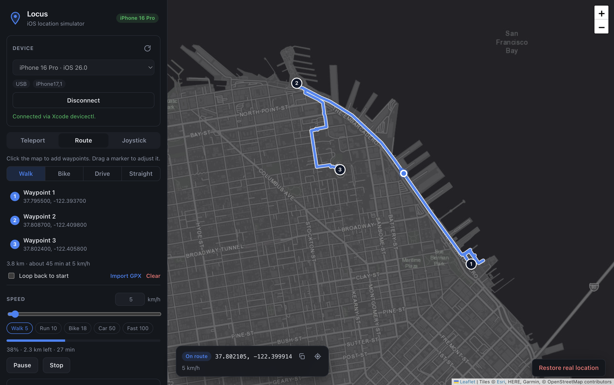

# Locus

A desktop app for **Windows and macOS** that simulates the GPS location of a real iPhone or iPad, so you can test location-based apps without leaving your desk. No jailbreak, nothing installed on the phone.



- **Teleport**: search a place, paste coordinates (or a Google Maps link), or click the map
- **Routes**: click waypoints and move along real roads (walk / bike / drive) or straight lines, with speed control, pause/resume and loop
- **GPX import**: replay a recorded track
- **Joystick**: steer with an on-screen stick or <kbd>W</kbd><kbd>A</kbd><kbd>S</kbd><kbd>D</kbd> / arrow keys
- Favorites and recents, optional position jitter and speed variance for natural-looking movement
- **Restore real location** in one click; this also happens automatically when you quit

## Requirements

| | macOS | Windows |
|---|---|---|
| OS | macOS 12+ (Apple Silicon or Intel) | Windows 10/11 x64 |
| iPhone/iPad | iOS 12 – 26+ | iOS 12 – 16, and 17.4+ |
| Extra | **Xcode recommended** (gives the most reliable connection, including over Wi-Fi) | **Apple Devices** (Microsoft Store) or iTunes for the USB driver |
| Admin rights | Not needed | Not needed |

On the iPhone, **Developer Mode** must be on (iOS 16+): *Settings › Privacy & Security › Developer Mode*. Locus can show you the toggle if it's hidden.

## Download

Get the latest installer from [Releases](https://github.com/abdiopp/locus/releases/latest): `mac-arm64.dmg` for Apple Silicon Macs, `mac-x64.dmg` for Intel Macs, or `win-x64.exe` for Windows.

## Using it

1. Connect the iPhone by USB (the first time), unlock it, and tap **Trust**.
2. Open Locus, pick the device, and click **Connect**.
3. Search for a place or click the map, then choose **Teleport here**. For movement, switch to **Route** or **Joystick**.
4. Click **Restore real location** when you're done.

## How it connects

Locus has a small Python engine (bundled, so you don't need Python installed) built on [pymobiledevice3](https://github.com/doronz88/pymobiledevice3). It picks the best transport for each device:

| Device | Transport | Notes |
|---|---|---|
| iOS 17+ on macOS with Xcode | `xcrun devicectl device simulate location` | Apple's own path. Works over USB or Wi-Fi, holds no session open, and is the most stable. |
| iOS 17.4+ (USB / Wi-Fi sync) | pymobiledevice3 in-process **userspace tunnel** | No root/admin. This is the main path on Windows. |
| iOS 17+ on macOS without Xcode | Piggyback on macOS's own `remoted` tunnel | Works, but macOS periodically takes the connection back. Locus reconnects automatically. |
| iOS ≤ 16 | Legacy `com.apple.dt.simulatelocation` | Mounts the Developer Disk Image automatically. |

You can force a method under **Advanced › Connection method**.

## Development

```bash
python3 -m venv .venv
```

```bash
.venv/bin/pip install -r engine/requirements.txt
```

```bash
npm install
```

```bash
npm start
```

On Windows, use `.venv\Scripts\pip` instead. In development the app runs `engine/engine.py` with the `.venv` interpreter; set `LOCUS_PYTHON` to use a different one.

### Building installers

```bash
npm run dist:mac
```

```bash
npm run dist:win
```

Each command bundles the engine with PyInstaller (into `build/engine`) and then packages the app with electron-builder (into `dist/`). PyInstaller can't cross-compile, so build each installer on its own OS. The GitHub Actions workflow in `.github/workflows/build.yml` does this for macOS (Apple Silicon and Intel) and Windows. Every push to `main` publishes the three installers as a `build-N` release (marked latest) on the [Releases](https://github.com/abdiopp/locus/releases) page; pushing a `v*` tag publishes a versioned release instead.

The macOS build is ad-hoc signed, not notarized. The first time, right-click the app and choose **Open**, or run `xattr -dr com.apple.quarantine /Applications/Locus.app`. To sign properly, set `mac.identity` in `package.json` to your Developer ID certificate.

### Layout

```
electron/   main process (spawns the engine, IPC, allowlisted HTTP proxy) + preload
renderer/   UI (Leaflet map, vanilla JS)
engine/     Python engine: JSON-lines protocol over stdio, device sessions, movement simulation
scripts/    engine bundling
```

## Troubleshooting

- **No iPhone found**: unlock the phone, re-plug the cable, and tap Trust. On Windows, make sure Apple Devices or iTunes is installed.
- **Developer Mode is off**: turn it on in Settings and restart the phone. Click **Reveal Developer Mode toggle** if it's missing.
- **iOS 17.0–17.3 on Windows**: these versions need a privileged tunnel. Update the device to 17.4+, or run `pymobiledevice3 remote tunneld` as Administrator.
- **Location stuck after a crash**: connect again and click **Restore real location**, or restart the iPhone.

## Prior art

Existing tools that were evaluated first: [LocWarp](https://github.com/keezxc1223/locwarp) (excellent, but Windows-only), [GeoPort](https://github.com/davesc63/GeoPort) (no iOS 26 support, last released 2024), [iFakeLocation](https://github.com/master131/iFakeLocation) and its [fork](https://github.com/efebagri/iFakeLocation) (.NET 6 + Python, manual tunnel setup on Windows), and [LocationSimulator](https://github.com/Schlaubischlump/LocationSimulator) (macOS-only).

## Disclaimer

This is meant for testing apps you develop or are authorized to test. Spoofing your location may violate the terms of service of other apps and games.
